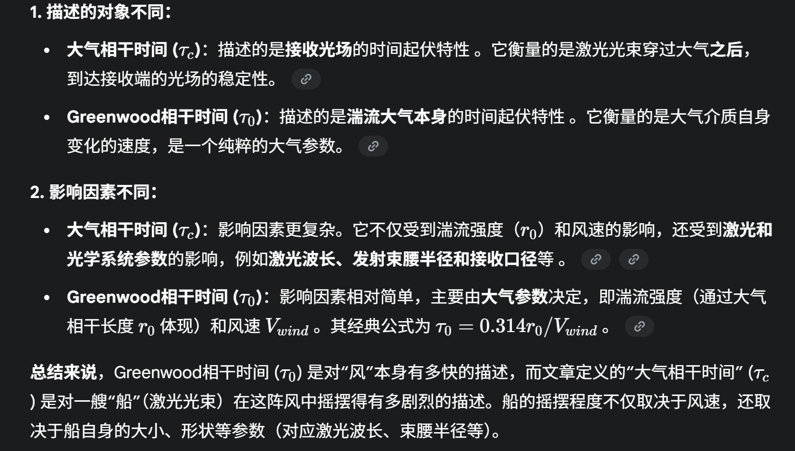

大气湍流对接收光场时间相干特性的影响

结论：

激光在大气传输过程中`其相干特性受湍流影响而下降`。通过仿真指出大气相干时间（文章中定义）与a.波长|b.接受口径|c.风速有关。与a，b呈正相关；与c呈反比。

引言：

激光在大气传输过程中，受环境影响发生退相干。在真实大气环境中，湍流是导致激光相干性退化的重要因素，主要体现在时间（`湍流大气以khz频率随机起伏，光强和相位随时间呈随机涨落`）与空间（`湍流使激光产生光斑漂移，光束扩展，并引起激光波阵面的畸变，从单模光场退化为多模光场，致使相干效率下降`）。

为了实现相干探测，对于激光的相位稳定性有着高要求。相干探测是持续过程，所以探测过程中湍流引起的激光光场随机起伏非常关键。接收光场的空间相关性退化使得外差效率低信噪比下降（`可以通过加大激光发射频率，自适应光学矫正等方法解决`）

仿真结果：

1.首先区分文章定义的大气相干时间和Greenwood相干时间的区别

2.仿真结论

| 参数类别         | 影响因素             | 对大气相干时间 ($\tau_c$) 的影响及原文解释                   |
| :--------------- | :------------------- | :----------------------------------------------------------- |
| **湍流参数**     | 大气相干长度 ($r_0$) | **呈正相关，湍流越弱 ($r_0$ 越大)，$\tau_c$ 越大。** 解释: 大气相干长度 $r_0$ 是描述“整个传输路径上湍流扰动的综合强度”的物理量。$r_0$ 的数值越大，代表路径上的湍流效应越弱。当湍流效应弱时，它对激光相位的扰动就小，接收到的光场自然就更稳定，起伏更慢，因此大气相干时间 $\tau_c$ 就越长。 |
|                  | 风速 ($v$)           | **呈反比关系，风速越大，$\tau_c$ 越小。** 解释: 文章将横向风速 $v$ 描述为决定大气湍流横向“漂移”速度的因素。根据“湍流冻结”假设，可以把湍流看作是固定的“湍流团块”被风吹过激光路径。风速越大，这些湍流团块“刷新”得越快，导致接收光场的相位和强度变化也越快、越剧烈，因此光场的稳定性下降，大气相干时间 $\tau_c$ 变短。 |
|                  | 传输距离 ($L$)       | **在路径综合湍流强度 ($r_0$) 不变时，$\tau_c$ 几乎不受影响。** 解释: 这是一个非常重要的澄清。仿真实验的前提是保持 $r_0$ 不变来研究距离 $L$ 的影响。$r_0$ 本身的定义就包含了距离 $L$ 和湍流折射率结构常数 $C_n^2$ 。 因此，当设定 $r_0$ 不变时，如果增加了传输距离 $L$，就必须相应地减小沿途的湍流强度 $C_n^2$，以保证路径上总的湍流效应不变。在这种“总效应不变”的理想条件下，单纯改变距离 $L$ 对光场的稳定性当然没有影响。 |
| **发射系统参数** | 激光波长 ($\lambda$) | **呈正相关，波长越长，$\tau_c$ 越大。** 解释: 湍流引起的是光程差的起伏 。对于同样大小的光程差，当波长 $\lambda$ 越长时，它所造成的相位起伏就越小。因此，长波长的光对湍流扰动“不那么敏感”，接收光场也相对更稳定，大气相干时间 $\tau_c$ 就更长。文章还举例说，这就是为什么微波波段的ISAR几乎不受湍流影响，而激光波段的ISAL却深受其扰。 |
|                  | 束腰半径 ($w_0$)     | **随 $w_0$ 增大呈“先增大后减小”的趋势，存在一个最优值。** 解释: 这是一个非常关键的实践性结论，是两种物理效应权衡的结果  1. 当束腰 $w_0$ 过小时: 激光的发散角会很大，导致接收望远镜只能接收到部分光场，使得 $\tau_c$ 较小。 2. 当束腰 $w_0$ 过大时: 虽然光束的发散角小，但过大的束腰半径仍导致接收光场直径较大，同样会使得 $\tau_c$ 较小。 因此，在发射端选择一个最优的束腰半径，可以最好地平衡发散效应和湍流扰动效应，从而获得最长的 $\tau_c$ 。 |
| **接收系统参数** | 接收口径 ($D$)       | **呈正相关，但当 $D$ 较大时会达到饱和，不再增加。** 解释:  1. 正相关性: 接收口径越大，相当于对接收到的光斑进行空间平均的范围越大。文章解释说，当口径D更大时，相邻两帧光斑的重叠部分更多，相干性更强，因此$\tau_c$ 也就更大。 2. 饱和效应: 当接收口径D已经大到可以完全接收下整个光斑时，再继续增大口径就没有意义了 。此时，$\tau_c$ 达到一个上限并保持不变，即出现饱和现象 。 |

注：

