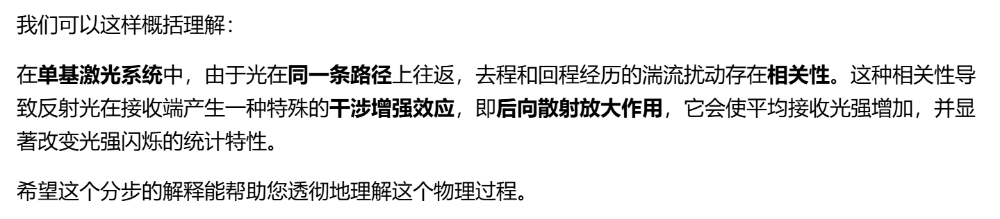

# 斜程大气湍流中点目标回波的闪烁研究

主要工作：数值模拟；基于修正Rytov方法，将斜程路径下双基系统及单基系统点目标回波的闪烁指数模型拓展至中度及强起伏湍流区域

## 引言：

2001年，Andrews等利用修正Rytov 方法推导了水平视距传播路径上可适用于从弱到强起伏条件下的回波闪烁指数模型.

本文基于修正 Rytov 方法并引入随高度变化的外尺度模型，进一步==将斜程大气湍流路径点目标(即横向尺寸远小于第一菲涅耳区尺寸的目标)回波的闪烁指数模型拓展至中等及强起伏湍流区域==，数值分析了单基系统与双基系统的闪烁指数，并根据计算结果讨论了采用随高度变化的外尺度的必要性。

## 正文

### 1.公式部分（设计空间折射率起伏谱，外尺度估算）

将大气湍流引起的折射率起伏作为平稳随机过程来进行处理：

==空间折射率起伏谱==$\Phi_{n}(\kappa)$采用修正 Hill 谱，该谱引入大尺度和小尺度滤波函数并且考虑了内、外尺度，表示形式为：
$$
\Phi_{n}(\kappa)=0.033 C_{n}^{2}(h)\kappa^{-11 /3}G(\kappa, l_{0},L_{0})
$$

$$
G(\kappa, l_{0},L_{0})\equiv G_{X}(\kappa, l_{0},L_{0})+G_{Y}(\kappa, l_{0})=f(\kappa l_{0})g(\kappa L_{0})\exp\left(-\frac{\kappa^{2}}{\kappa_{X}^{2}}\right)+\frac{\kappa^{11 /3}}{\left(\kappa^{2}+\kappa_{Y}^{2}\right)^{11 /6}}
$$

式中$\kappa$表示大气湍流的空间频率

$\kappa_{x}$、$\kappa_{y}$分别表示大、小尺度湍流的空间截止频率

$G(\kappa, l_{0}, L_{0})$表示空间滤波函数

$G_{x}(\kappa, l_{0}, L_{0})$及$G_{y}(\kappa, l_{0})$分别表示大、小尺度滤波函数

$h$为传输高度，$l_{0}$及$L_{0}$分别表示内、外尺度

$f(\kappa l_{0})$及$g(\kappa L_{0})$为描述内、外尺度修正模型的因子，分别表示为
$$
f\left(\kappa l_{0}\right)=\exp\left(-\frac{\kappa^{2}}{\kappa_{l}^{2}}\right)\left[1+1.802\frac{\kappa}{\kappa_{l}}-0.254\left(\frac{\kappa}{\kappa_{l}}\right)^{7/6}\right]
$$

$$
g\left(\kappa L_{0}\right)=1-\exp\left(-\frac{\kappa^{2}}{\kappa_{0}^{2}}\right)
$$

其中，$\kappa_{l}=3.3 / l_{0}$，$\kappa_{0}=8\pi / L_{0}$。

由于外尺度随高度变化，且在中度及强起伏区域作用明显，因此，本文采用Colman等[13]所推出的==外尺度估算公式==来表示：

$$
L_{0}(h)=\left\{\begin{array}{l}
\frac{1}{2}\left[\frac{4}{1+\left(\frac{h-8500}{2500}\right)^{2}}+\frac{5}{1+\left(\frac{h-7500}{2000}\right)^{2}}\right],\quad h>2000\mathrm{~m}\\
L_{0}(h)=1.552\mathrm{~m}\quad, h\leqslant 2000\mathrm{~m}
\end{array}\right.
$$

$C_{n}^{2}(h)$为大气折射率结构常数

本文采用随高度变化的ITU-R大气折射率结构常数模型：
$$
C_{n}^{2}(h)=8.148\times 10^{-56}\nu_{\mathrm{RMS}}^{2}(h)^{10}\exp (-h/1000)+2.7\times 10^{-16}\exp (-h/1500)+C_{n0}^{2}\exp (-h/100),\quad(6)
$$

式中$\nu_{\mathrm{RMS}}^{2}=\sqrt{v_{g}^{2}+30.69v_{g}+348.91}$，是垂直路径风速，$v_{g}$是近地面风速(典型值为2.8m/s)，$C_{n0}^{2}$是地平面附近的大气结构常数(典型值为$1.7\times 10^{-14}\mathrm{~m}^{-2/3}$)。

### 2.斜程大气湍流中点目标回波闪烁指数

当接收器与发射器距离大于菲涅耳半径时，称为双基系统，否则称为单基系统。

在双基系统中，入射光束与反射光束相互独立地穿越大气湍流，上行线路与下行线路之间无相关作用。

在单基系统中，光束经由折叠路径(*AECFA*)与相反路径(*ABCDA*与 *ADCBA*)传播时，由于入射光束与反射光束穿越同一大气湍流，由大气湍流引起的复相位扰动中含有两种路径所对应的相关项，进而引起对闪烁指数构成影响的后向散射放大作用。

### 3.公式：单基系统的斜程大气湍流中点目标回波闪烁指数

$$
\sigma_{I}^{2}(\mathbf{r}, 2L)_{\text{monostatic}} \approx \sigma_{I}^{2}(2L)_{\text{bistatic}} + 2\left\{\exp\left[-B_{\ln I}^{\mathrm{iR}}(0, L)\right] - \exp\left[-2B_{\ln I}^{\mathrm{iR}}(0, L)\right]\right\}\left[1 + \sigma_{I}^{2}(2L)_{\text{bistatic}}\right]
$$

推导过程复杂，在此不展开。

### 4.数值分析以及结论

取发射激光波束宽度为 1 cm，*H=L*/3，*L* 取值为 20 km

湍流分别处于弱起伏 (*σ*0 = 1) 、中等起伏 (*σ*0 = 6) 与强起伏 (*σ*0 = 30) 状态下：

结果表明：在弱起伏湍流区域，闪烁指数受内尺度作用明显，外尺度的影响可忽略；随着湍流起伏强度的增强，外尺度对于闪烁指数的贡献逐渐增大，内尺度对于闪烁指数的贡献逐渐减小。

这是由于对==闪烁起主要作用的是与相关长度同尺度的湍流==，相关长度随着湍流强度的增加而减小。湍流较弱时，造成闪烁的主要是菲涅耳半径大小的湍流；在中等强度湍流区域，内尺度大小的湍流逐渐成为主要影响因素；随着湍流强度继续增大，内尺度对闪烁指数的贡献逐渐减小

