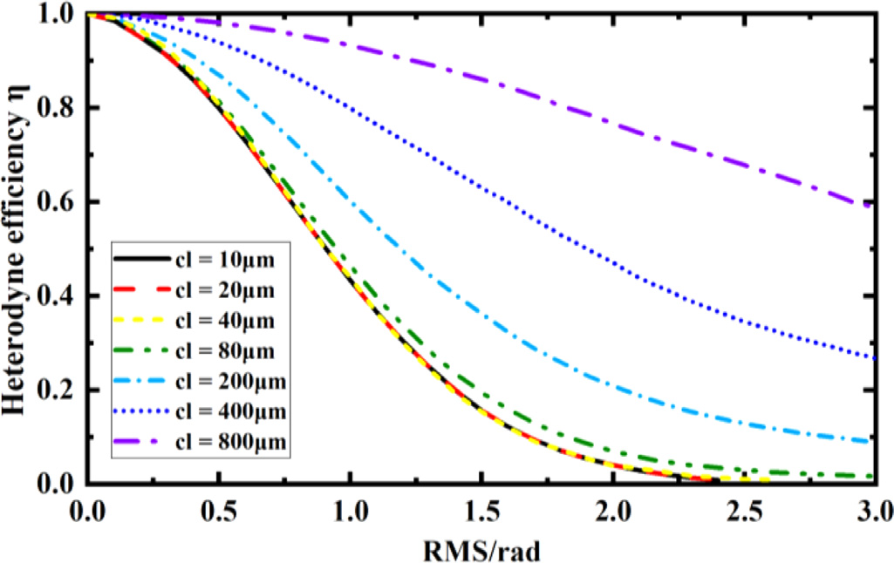
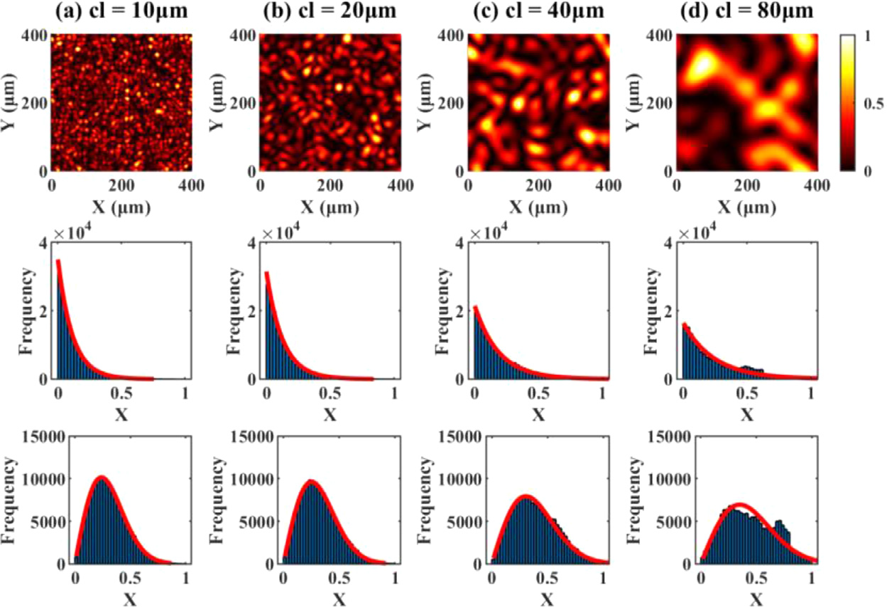
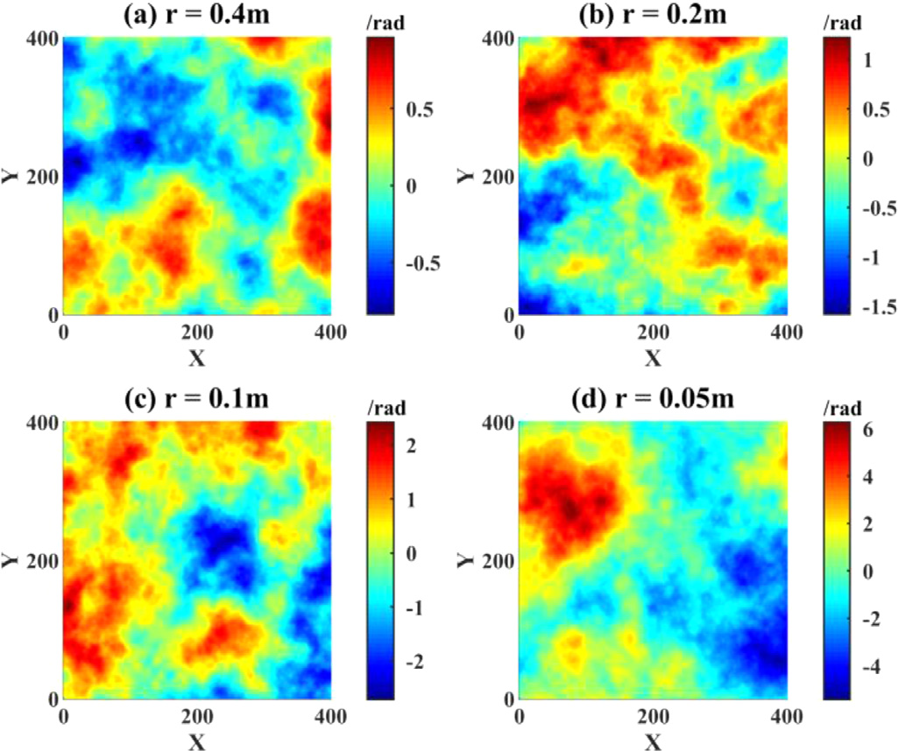
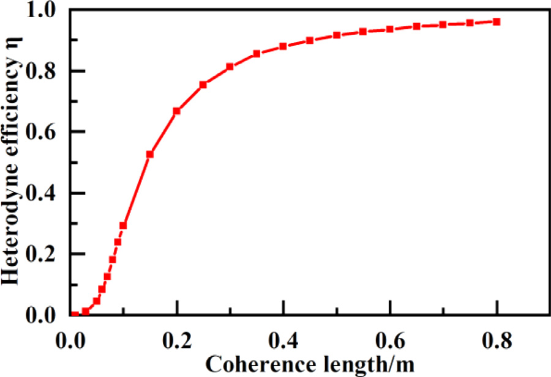
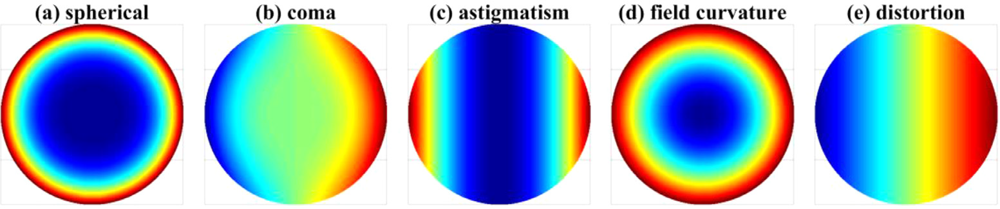
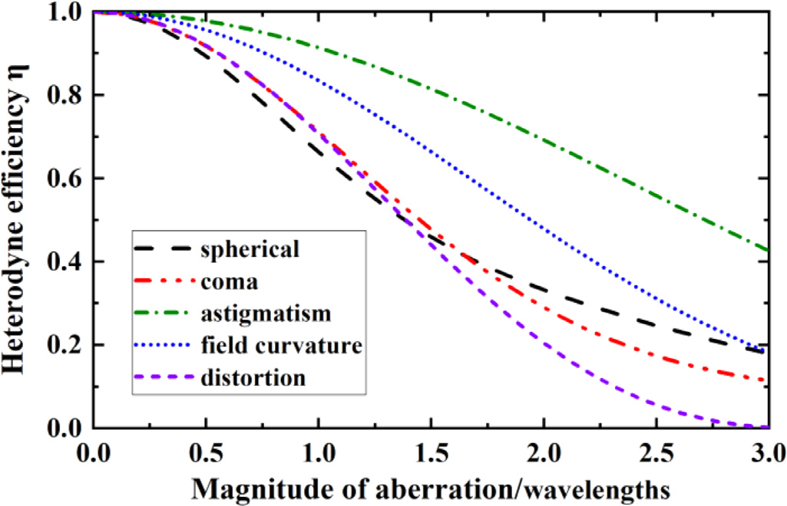
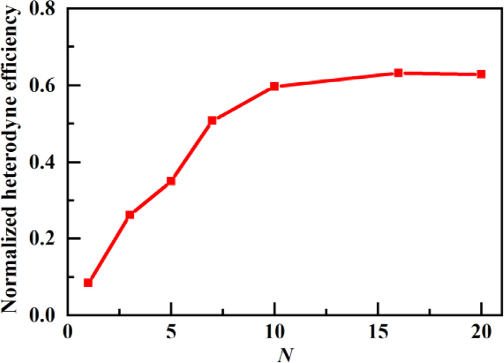

# Factors influencing the applications of active heterodyne detection

## 主要工作:

本文提出了一种`通过在探测器表面平面上混合本振光束和定制的信号光束来计算外差效率的方法` 。结果表明，如果信号光的振幅分布遵循某一特定分布，则外差效率是固定的，但相位失配会显著降低系统灵敏度 。此外还`开发了一套高速相机外差系统`，用以评估遗传算法在主动外差探测应用中校正空间相位失配的有效性 。

## 工作细节

### 1.外差效率

假设量子效率在探测器区域内是均匀的，外差效率可以表示为 [16]：

$$
\eta = \frac{\{\int_{A} |E_S||E_L| \cos[\varphi(r)] dA\}^2 + \{\int_{A} |E_S||E_L| \sin[\varphi(r)] dA\}^2}{(\int_{A} |E_S|^2 dA \int_{A} |E_L|^2 dA)}
$$

其中 IF 是中频（intermediate frequency），A 是光电探测器的面积，$E_S$ 和 $E_L$ 分别是信号场和本振场的振幅，而 $\varphi(r)$ 是两光束之间的相位失配，该失配与空间位置相关。

许多主动外差探测应用会遇到光学粗糙的目标表面，这会产生散斑。当激光束从这样的表面反射时，其波前会受到该表面的调制，这可能导致探测器平面上相位和振幅的分布失配。这会导致系统灵敏度下降或产生退相干效应。

### 2. 散斑相位

接下来的处理考虑相位调制对外差系统性能的唯一影响。考虑到 $E_S$ 和 $E_L$ 的分布是均匀的，并且激光输出光束和本振光束都具有平面波前且呈线性偏振，则有：

$$
\eta_{\varphi} = \frac{\{\int_{A} \cos[\varphi(r)] dA\}^2 + \{\int_{A} \sin[\varphi(r)] dA\}^2}{A^2}
$$

通常，`由粗糙表面反射的散斑光束的高度起伏可以被视为一个零均值的高斯随机变量`，其统计参数可以用均方根（RMS）值和相关长度（cl）来描述。光波的波长（测量尺度为数百纳米）远小于实际粗糙表面的起伏；因此，散斑场的相位在 $(-\pi, \pi)$ 区间内服从均匀分布。由于随机相位的波动，来自探测器不同单元产生的外差信号会相互抵消，因此有：

$$
\langle i_{IF} \rangle = 0
$$

其中，尖括号表示统计平均值，$i_{IF}$ 是光电探测器产生的总中频光电流。

公式 (3) 表明，`由于本振光束和信号光束之间的分布失配，作为外差接收机输出测得的有用中频（IF）信号的振幅等于零`，无论信号有多强。这种零均值特性给探测中频信号带来了巨大困难。增加中频放大器的增益或探测功率并不能有效解决这个问题。

在光电探测器表面上对散斑场进行建模，将激光波长设置为 $1~\mu m$，探测器的边长设置为 $400~\mu m$。采样率设置为每微米一个点，因此散斑场可以解析地表示为一个包含 $400 \times 400$ 个元素的矩阵。

基于蒙特卡洛方法，上图展示了外差系统接收到的五种独立的散斑模型。`这些模型代表了外差系统获得的具有不同 RMS 值和相关长度的散斑场。`图 2(a)、(b) 和 (c) 中的散斑场是在相同 RMS 值但不同相关长度的条件下模拟的。对于相同的 RMS 值，相关长度越大，对应的相位变化频率越低。图 2(a)、(d) 和 (e) 中的散斑场是在相同相关长度但不同 RMS 值的条件下模拟的。RMS 值越大，对应的散斑场相位分布范围越广。

每个模拟的散斑场`下方是其统计直方图，并已应用高斯拟合`。散斑场起伏的 RMS 值决定了相应散斑场等高线图中的最大峰值。散斑场起伏的 RMS 值越大，拟合曲线越宽。相关长度决定了独立散斑单元的数量。相关长度越小，系统接收到的独立散斑单元数量越多，导致统计直方图与高斯拟合曲线之间的拟合效果越好。

在计算外差效率时，一束光代表本振光，它保持着平面波前；另一束光代表信号，它入射到光学粗糙的目标表面，并在其波前上附加了散斑相位。因此，图 2 所示的散斑场可以由光电探测器表面上本振光束和信号光束之间的相位失配来表示。为了说明散斑场对外差效率的影响，我们将具有不同统计参数的散斑场代入公式 2。

图 3 显示了外差效率随 RMS 值和相关长度变化的曲线。总的来说，RMS 值越大且相关长度越小，对应的外差效率越低。

在保持相关长度固定的情况下，即使散斑场的 cl 值大于探测器边长，外差效率也会随着 RMS 值的增加而迅速下降。对于小于 $40~\mu m$ 的相关长度，改变相关长度对外差效率的影响可以忽略不计。相位起伏仅需大约 2.5 rad 的 RMS 值，就足以使外差信号相互抵消至零，此时退相干效应会显著降低外差系统的性能。由目标粗糙表面引起的退相干效应现象仍然是限制光学外差探测实际应用的主要障碍。**这就是为什么大多数已报道的合成孔径激光雷达实验都使用合作目标作为研究对象的原因。**

### 3. 散斑图样

现在，我们仅关注振幅调制对外差系统性能的影响。假设本振光束和信号光束都具有平面波前且呈线性偏振，因此有：

$$
\eta_{A} = \frac{(\int_{A} |E_S||E_L| dA)^2}{(\int_{A} |E_S|^2 dA \int_{A} |E_L|^2 dA)}
$$

假设 $E_L$ 的分布是均匀的，且本振场的振幅是一个常数 c，则：

$$
\eta = \frac{(\int_{A} c|E_S| dA)^2}{(\int_{A} |E_S|^2 dA \int_{A} c^2 dA)} = \frac{(\frac{\int_{A} |E_S| dA}{A})^2}{\frac{\int_{A} |E_S|^2 dA}{A}}
$$

公式 (5) 表明，当仅考虑振幅调制因素时，`外差系统的性能与信号场的振幅分布有关`。系统的外差效率等于信号振幅统计平均值的平方与信号强度统计平均值之比。因此，如果信号光的振幅分布遵循某一特定分布，则系统的外差效率是固定的。

由粗糙目标表面引起的振幅调制会导致高强度和低强度的混沌分布，即散斑图样。只要独立散斑单元的数量足够大，相干照明下散斑图样的实部和虚部就服从高斯分布，振幅服从瑞利（Rayleigh）分布，而强度则服从负指数分布。

与上述的散斑场建模一样，我们将散斑图样解析地表示为一个 $400 \times 400$ 元素的矩阵。由于光强会随着传播而衰减，因此模拟的散斑图样均进行了归一化处理。

系统接收到的具有不同相关长度的散斑图样示例显示在图 4 (a)-(d) 中，(1) 被归一化为 1。cl 值决定了散斑强度的变化频率；cl 值越小，强度变化越频繁。同时，在这种情况下，cl 值也对应于外差系统接收到的单个散射分量的数量。cl 值越小，导致单个散射分量越多。

图 4 的`第二行显示了每种散斑图样的统计直方图和负指数拟合结果`。`第三行显示了对应于每种散斑图样振幅的统计直方图和瑞利拟合结果`。模拟的散斑图样的强度和振幅分别与负指数分布和瑞利分布高度吻合。散斑图样的相关长度越小，其强度的负指数分布拟合曲线的斜率越陡峭，其振幅的瑞利分布拟合曲线越窄。此外，相关长度越小，系统接收到的单个散斑单元数量就越多，同时统计直方图与拟合曲线之间的一致性也越好。并且，当散斑图样的相关长度足够小时，强度和振幅的拟合结果都是一致的。

为了说明改变散斑图样对外差效率的影响，将具有不同统计相关长度的模拟散斑图样代入公式 (5)。图 5 显示了外差效率随相关长度变化的曲线。外差效率曲线分为两部分。第一部分（如图 5(a) 所示）显示了当相关长度 $\le 20~\mu m$ 时外差效率的变化。在此区间，改变相关长度的值对外差效率几乎没有影响，表现为一条近似水平的直线，其值约为 0.7855。散斑图样的统计特性在很大程度上不随相关长度的变化而改变。

第二部分（如图 5(b) 所示）显示了当相关长度 $\ge 20~\mu m$ 时外差效率的变化。随着相关长度的增加，单个散射分量的数量减少（散斑图样统计特性的变化如图 4 所示）。因此，外差效率和外差曲线的斜率都随着相关长度的增加而增加。在这种情况下，外差效率大于 0.7855。

简而言之，由粗糙目标的振幅调制引起的散斑不会显著降低外差系统的性能。如果信号光的振幅分布遵循某一特定分布，外差效率是固定的。然而，相位失配会显著降低系统灵敏度。因此，研究如何校正外差探测中由目标散斑引起的随机相位失配是一个重要的课题。

### 4. 大气湍流及其对外差效率的影响

由于大气湍流的影响，随机的相位起伏被添加到了传播中激光束的波前上。因此，为了说明大气湍流对光传输的影响，有必要对其随机过程进行数值模拟。例如，功率谱反演法（power spectrum inversion method）根据所提出的大气湍流功率谱密度函数来得出大气湍流的相位分布。该方法使用离散傅里叶变换，计算速度快，使其适用于分析不同形式的湍流 。然而，通过功率谱反演法产生的大气湍流相位屏缺乏大量的低频信息，导致其不够准确。为了解决这种低频信息的缺失，已有人提出了低频补偿方案，以确保大气湍流模拟的准确性。

回想一下，对于一个外差系统，一束光代表保持平面波前的本振光（LO），而另一束光代表穿过大气湍流的信号，其波前上附加了一个随机的空间湍流场。因此，如图 6 所示，大气湍流场可以由探测器平面上本振光束和信号光束之间的相位失配来表示。基于公式 (2)，图 7 展示了考虑具有不同相干长度的大气湍流场时，外差效率的变化情况。

总的来说，随着相干长度的减小，湍流的强度逐渐增加。湍流场的相干长度对外差效率有显著影响：相干长度值越小，对应的外差效率也越低。弱湍流不足以急剧降低系统性能。相反，强湍流会显著降低外差系统的灵敏度，甚至导致退相干效应。

### 4. 赛德尔像差及其对外差效率的影响

当光束的波前偏离预期的（或参考的）表面（通常是球面）时，就会产生波前像差。波前像差主要反映在波前的相位分布。通常，由附加到波前的相位引起的像差几乎不影响光强；因此，光束的相位分布无法被直接观测到。然而，这些相位分布反映了光束的变化。

幂级数是表示光学系统像差的一种常用方法：

$$
\phi(\sigma, \rho, \theta) = \lambda \sum_{l, m, n} W_{l, m, n} \sigma^l \rho^m \cos^n \theta
$$

其中，$\lambda$ 是传输波长，$W_{l, m, n}$ 是以波长整数倍表示的波前像差系数，$\sigma$ 是归一化的物场坐标，$\rho$ 是归一化的光瞳半径，$\theta$ 是光瞳方位角。根据旋转对称性，指数 $l$、 $m$ 和 $n$ 仅可能出现五种特定的组合。这五个二阶项被称为赛德尔（Seidel）像差，或初级像差，分别表示为球面像差（spherical）、彗形像差（coma）、像散（astigmatism）、场曲（field curvature）和畸变（distortion）。与这些像差相关的波前像差系数在表 1 中列出。通常，这些波前像差系数具有有限值，每一项都代表了波前与理想球面的一种特定偏离类型。

**表 1**
五种赛德尔像差的波前系数。

| 名称     | 函数形式                        | 波前像差系数 |
| :------- | :------------------------------ | :----------- |
| 球面像差 | $\rho^4$                        | $W_{040}$    |
| 彗形像差 | $\sigma \rho^3 \cos \theta$     | $W_{131}$    |
| 像散     | $\sigma^2 \rho^2 \cos^2 \theta$ | $W_{222}$    |
| 场曲     | $\sigma^2 \rho^2$               | $W_{220}$    |
| 畸变     | $\sigma^3 \rho \cos \theta$     | $W_{311}$    |

图 8 描绘了对应于五种赛德尔像差的示例波前形状。图 8 (a)-(e) 分别对应于球面像差、彗形像差、像散、场曲和畸变。

为了说明赛德尔像差对外差系统的影响，我们通过将受影响的光束代入公式 (2) 来系统地研究这五种赛德尔像差的影响。与我们之前的模拟类似，一束光代表保持平面波前的本振光（LO），而另一束光代表在穿过光学系统后其波前获得了像差的信号。`计算中考虑了单程传输`。与图 8 所示的像差示例不同，受像差影响的信号光束与本振光束充分混合，以填充光电探测器的整个表面。

图 9 显示了外差效率作为五种像差类型函数的曲线。瑞利（Rayleigh）曾提出，当实际波前与参考波之间的最大波前差低于波长的四分之一时，该波前可被视为无缺陷。该论述同样适用于光学外差探测系统。当像差的幅度小于波长的四分之一时，外差系统的效率受到的影响可以忽略不计。

总的来说，光学系统像差会降低外差效率。对于任何一种初级像差，系统的灵敏度都随着像差幅度的增加而迅速下降 。然而，外差系统对各种初级像差的响应并不一致：外差系统对畸变最为敏感，而对像散最不敏感。当畸变的幅度导致等于 3 个波长的视差时，外差效率几乎为零。因此，由光学系统像差引起的相位失配是影响外差效率的一个重要因素。

### 5. 基于阵列探测器和遗传算法的外差系统

与振幅失配相比，本振光（LO）和信号光束之间的相位失配对外差系统性能的影响更为严重。由于空间相位失配通常是随机的，因此计算这些失配并对其进行补偿以提高外差系统性能非常重要 。Dong 等人提出了一个基于阵列探测器的外差系统模型，`使用遗传算法来量化所有单元的相移` 。

为了评估遗传算法在主动外差探测应用中校正空间相位失配的有效性，我们开发了一套高速相机外差系统。图 10 展示了该高速相机外差探测系统的示意图。通过结合使用声光调制器 AOM1 和 AOM2，外差信号的频率 $\Delta f$ 发生了频移。由于激光线宽的影响，高速相机（MEMRECAM HX-7s, NAC Co., Ltd.，传感器尺寸：$320 \times 88$ 像素，帧率：100 kfps）记录的外差信号带宽约为 20 kHz 。信号光和本振光的光功率分别为 0.05 μW 和 0.25 μW。使用了一个孔径光阑（Aperture Stop, AS）以确保高速相机能捕获全部光束能量，从而保证实验的一致性。

使用该外差探测系统记录的实验测量示例如图 11 所示。具体来说，图 11(a) 显示了镜面靶的外差图像，而图 11(b) 显示了 1.6 μm 标准板的外差图像。每幅图像由 $80 \times 80$ 像素组成，测量尺寸为 $880~\mu m \times 880~\mu m$。很明显，粗糙的目标表面会导致本振光束和信号光束之间的失配。

通过直接对每幅外差图像中的像素光强度值求和，可以获得单探测器系统中的离散时域外差信号结果。图 11(c) 和 (d) 分别描绘了对应于镜面靶和 1.6 μm 靶的外差信号频谱分析结果。由于相机采样率为 100 kHz，因此可以获得 50 kHz 以内的信号频谱。尽管相机捕获的单个散斑单元数量很少，但在相同光功率下，1.6 μm 靶的外差信号与镜面靶相比显著下降。

`遗传算法采用一种概率优化方法，能够自适应地调整搜索方向。在运行时，它们基于一个随机的初始种群进行搜索。通过随机的选择、交叉和变异操作，产生一组更适合环境的个体，并且种群会向搜索空间中越来越好的区域进化。通过不断的繁殖和进化，遗传算法最终收敛于一组最适合环境的个体，从而很可能产生问题的最优解。`

作为一种评估方法，适应度函数（fitness functions）在相调整计算中扮演着重要角色。在本研究中，从外差图像到 $N \times N$ 阵列信号的转换是通过一个合并程序完成的。我们将外差频率范围 $\Delta f$ 内的频率分量之和作为适应度函数，`使用 MATLAB 遗传算法工具箱来确定所有阵列单元的相位调整量`。我们采用了所提出的阵列分组方法来克服因阵列单元数量过多而导致的计算能力不足的困难。

图 12 显示了 $N \times N$ 阵列外差系统的归一化外差效率作为 N 的函数。我们使用镜面靶实验的适应度来归一化 1.6 μm 靶的外差信号。很明显，阵列探测器显著增强了外差系统的性能 。对此的解释是，当探测器面积减小时，单个散射分量的数量也会减少。因此，阵列探测器系统在应用了相干叠加处理后表现更佳。

$N \times N$ 阵列探测器系统的外差效率在外差效率曲线的起始阶段随 N 近似线性增加。这一结论与文献报道的理论结果以及我们先前工作的模拟结果 [13] 相一致。当 $N \ge 10$ 时，线性关系无法维持，归一化外差效率稳定在约 0.6 的水平，此后随 N 的变化波动很小。对于 $N = 10$，可以认为探测器单元平面内的相位分布是均匀的，探测器单元尺寸的减小对外差效率影响不大。同样，阵列单元尺寸对外差效率的影响也极小。然而，外差效率并不能随着 N 的增加线性增长到 1。这种现象可能是由振幅调制或失准角（misalignment angle）引起的。

外差频率范围通常是已知的，因此使用阵列探测器来提高外差探测系统的性能是可行的 。然而，高速相机的采样率无法满足实际需求。此外，二维阵列 PIN（Positive-Intrinsic-Negative）探测器系统生产起来过于复杂，且很少有市售产品。即使不考虑这些因素，优化算法的计算结果也依赖于系统，且阵列单元的数量会影响计算时间。因此，需要进一步的研究来将该技术发展为实际应用。

### 6. 结论

主动外差探测应用受到多种影响因素的制约，如目标散斑、大气湍流和光学系统像差，这些因素会降低系统灵敏度或导致退相干。`外差效率反映了本振光（LO）光束与接收到的信号光束之间的相位和振幅匹配状态，因此是系统性能的一个指标`。本文中，我们提出了一种通过在探测器表面平面上混合本振光束和定制信号光束来计算外差效率的方法。

我们的研究结果表明，如果信号光的振幅分布遵循某一特定分布，则外差效率是固定的，但相位失配会显著降低系统灵敏度。由粗糙目标表面引起的退相干现象，仍然是限制主动光学外差探测实际应用的主要障碍。因此，`研究如何校正外差探测中由目标散斑引起的随机相位失配`是一个重要的课题。所提出的模拟框架可以成为评估外差系统性能的有用工具。

为了评估遗传算法在主动外差探测应用中校正空间相位失配的有效性，我们开发了一套高速相机外差系统。从外差图像到阵列信号的转换是通过一个合并（binning）程序完成的。以频率范围内外差信号的频率分量之和作为适应度函数，遗传算法量化了每个阵列探测器单元的相位调整量。结果表明，所提出的阵列探测器系统在经过相干叠加处理后，显著增强了外差系统的性能 。阵列探测器显著提高了外差系统的信噪比（SNR），这有益于诸如合成孔径激光雷达、激光测振和远程相干激光雷达等主动探测应用。但是，由于优化算法的计算结果是基于迭代的，因此在高速信号处理的应用中会存在局限性 。

