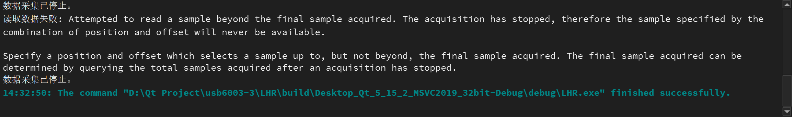

# 代码调试日志：

1.

2.原因分析

NIDAQ配置跟数据读取逻辑之间有冲突

（将DAQ任务配置为**有限采样模式 (Finite Samples)** 并使用**外部触发 (Digital Edge Start Trigger)**，但数据读取逻辑却是一个由`QTimer`驱动的**连续轮询模式**。）

流程分析：

**启动 (`on_startButton_clicked`)**

- 调用 `setupNIDAQTask()`。
- 启动 `updateTimer`，**每100毫秒**触发一次 `updatePlots()`，`updatePlots()` 进而调用 `readData()`。

**配置 (`setupNIDAQTask`)**

- `DAQmxCfgSampClkTiming(..., DAQmx_Val_FiniteSamps, sampleCount)`: 告诉DAQ硬件：“请准备采集**固定数量**（例如2870个）的样本。”
- `DAQmxCfgDigEdgeStartTrig(..., "PFI0", ...)`: 您告诉DAQ硬件：“在调用`StartTask`后，**不要立即开始**，请等待PFI0端口上出现一个上升沿信号（即外部触发）。”
- `DAQmxStartTask(taskHandle)`: 任务启动。此时，硬件进入“已准备”状态，*等待触发信号*。

**读取循环 (`readData`)**

- `updateTimer` 启动后，`readData()` **立即**（或在100ms内）被**第一次**调用。
- `DAQmxReadAnalogF64(..., sampleCount, 10.0, ...)`: 此函数开始执行。由于任务在等待触发，`Read`函数会*阻塞*（挂起），等待数据。
- **（等待...）** 此时，程序在`readData`函数中等待。

**发与采集（关键点）**

- **外部触发信号（PFI0）抵达。**
- 硬件开始**立即**采集*所有* `sampleCount` (2870) 个样本。
- 采集完成后，`DAQmxReadAnalogF64` 函数成功返回，将2870个样本读入您的 `data` 向量中。
- **【核心问题】**: 因为配置的是 `DAQmx_Val_FiniteSamps`，DAQ任务在成功采集并交付这2870个样本后，**任务自动进入“停止” (Stopped) 状态。**

**处理与下一次读取**

- `processData(data)` 被调用。`currentAverage` 递增（变为 1）。
- `updatePlots()` 完成，GUI刷新。
- （等待100毫秒...）
- `updateTimer` **第二次**触发 `updatePlots()` -> `readData()`。
- `readData()` **第二次**被调用。

**错误触发**

- `DAQmxReadAnalogF64(...)` 再次被调用。
- 但是，`taskHandle` 指向的任务**已经停止了**（在步骤4中自动停止）。
- 试图从一个已经停止并且所有数据都已被读取的任务中，再次读取新的样本。
- NIDAQmx驱动程序检测到这个无效请求，立即返回错误：“Attempted to read a sample beyond the final sample acquired. The acquisition has stopped...”（您试图读取的样本（当前读取位置之后的样本）将永远不可用，因为采集已经停止）。

改进思路

3.1 

