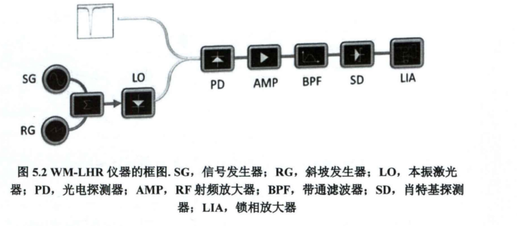
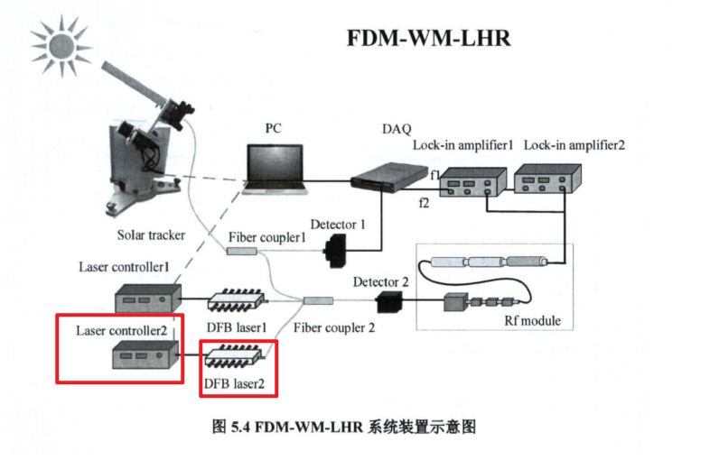

# 激光外差光谱技术及反演方法研究-孙春艳博士论文

## 5.2 全光纤近红外波长调制激光外差光谱技术研究

波长调制——获得高信噪比，无基线外差信号

单通道频分复用——实现多组分探测需求

探测气体：CO2和CH4

### 5.2.1 大气CH4单通道全光纤波长调制激光外差光谱技术

LO：1542nm；

SG信号发生器产生高频信号叠加到RG产生的低频三角波上，作用在电光强度调制器上，调制激光器发光；

BPF：40-150MHZ；

CH4 DFB激光器中心波长：1.653um；

DC信号用于归一化光功率；RF信号用于外差探测；

RF信号通过3个射频放大器以及带通滤波器（CH4：395MHz至520MHz)进行放大和滤波；

### 5.2.2 大气CO2和CH4单通道频分复用波长调制探测技术

较大的调制振幅会产生更宽的谱线，降低分辨率

