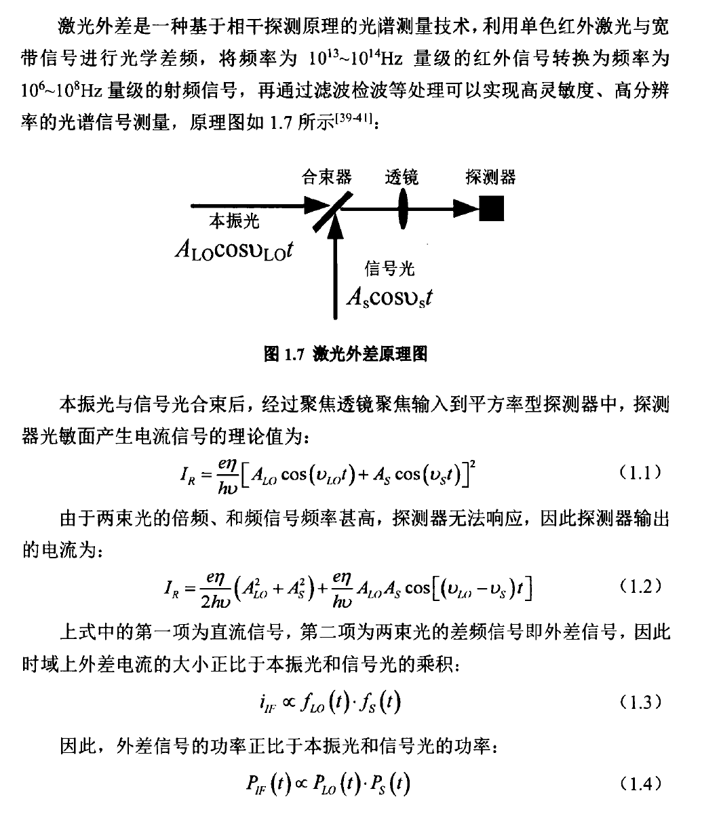
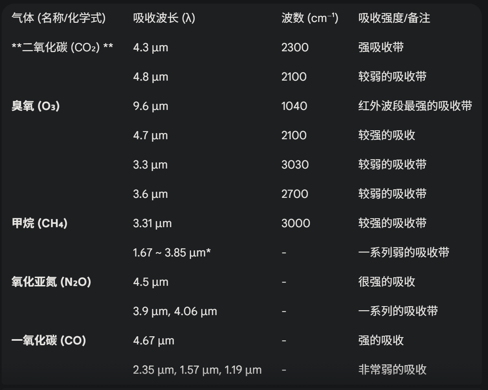
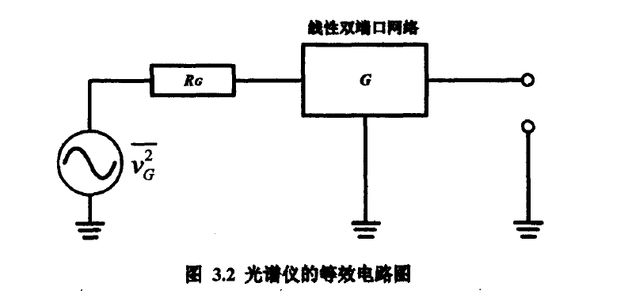

温室气体激光外差光谱测量技术与反演算法研究

臭氧$\ce{O3}$在9.6μm处有较强吸收

例如传统的大气信道有0.8μm、1.064μm和1.55μm等波段，都是大气吸收较弱的波段。

激光外差光谱测量原理：

通过以上分析，可以看出激光外差技术具有两个特点：（1）外差信号的频率是本振光频率与信号光频率之差，信号光中与本振光频率相近的信号，频率将会从红外范围下降到射频范围，易于后续信号处理；

（2）外差信号功率与本振光、输入信号功率呈正比，当本振光功率较大时，对弱信号有放大作用，可实现高灵敏度探测

注：

激光外差光谱仪的测量光谱范围受限于激光器的波长调谐范围，目前比较成熟的DFB或QCL激光器无跳模扫描的范围有限，DFB激光器一次性扫描的范围一般在10cm^-1^以内，QCL激光器一般在100cm^-1^以内，这使得激光外差光谱仪单次可测量的光谱范围小于傅里叶变换光谱仪和空间外差光谱仪。

2.分子吸收光谱

3.激光外差光谱测量技术与反演算法

激光外差光谱仪的信噪比可以反映最小探测能力，仪器线型函数则可表明光谱仪可分辨的最窄谱线宽度，因此，信噪比和光谱分辨率激光外差光谱仪的两个重要参数。

3.1信噪比分析

激光外差光谱仪中使用到的器件较多，其中既包括有源器件，如外差混频器或中频放大器；也包括无源器件，如滤波器或光学元件。因此，通过直接分析各个器件的噪声得到信噪比的难度很大。为此，可以将其简化为一系列线性双端口系统，然后从线性系统分析的一般方法入手，将功率检波器前的望远镜系统、光电探测器和射频放大器等效为具有一定温度的噪声源。使用这种方法分析，可较容易地得到整个光谱仪的等效噪声温度，等效噪声示意图如图3.1所示：

此时，将整个测量系统可简化为一个阻抗为Rg的热噪声源和一个线性双端口网络组成，热噪声源作为输入端。

4.双波段激光外差光谱仪

信号传输损耗大小，信号与本振光的合束质量，光路的抗干扰能力，都会直接影响光谱数据质量

信噪比：选定测量光源和波长的情况下，A探测器量子效率，B光路传输效率，C增大积分时间，D滤波带宽均可以提高信噪比。E信号处理电路中各端口的阻抗匹配程度也会影响信噪比。

C增大积分时间和D滤波带宽会降低光谱分辨率，光谱数据变得平滑。

A光电探测器量子效率出厂即固定，E电路各器件端口阻抗为定值。

提高光谱仪的光路传输效率，减小输入信号在光谱仪内部传输损耗，增大输入功率可有效提高信噪比。

光谱分辨率：激光外差光谱仪的光谱分辨率不仅与射频滤波带宽有关，还与锁相放大器的积分时间有关（仪器线型函数）。

​	积分时间越大或者扫描时间越短，平滑效应也就越明显。

​	在保证信噪比的同时尽可能增大扫描时间或减小积分时间，以获得较高的光谱分辨率。

具体操作：控制激光调谐的扫描波形由正弦波调整为三角波，扫描周期为15s、占空比设置为20%，有效测量时间即为12s。使用这种设置有以下两个优点：（1）使用三角波调制，扫描范围内波长为线型变化，计算线型函数时比较简便；（2)三角波占空比为20%，激光器扫描的上升沿有3s的缓冲时间，激光器的电流和温度不会发生突变，在尽可能缩短测量周期的同时，保证了激光波长和功率的稳定性。

实验发现，推导出的仪器线性函数和RF滤波器响应函数有很大差异，如果反演中使用RF滤波器响应函数替代仪器线性函数，结果会有很大差异。

