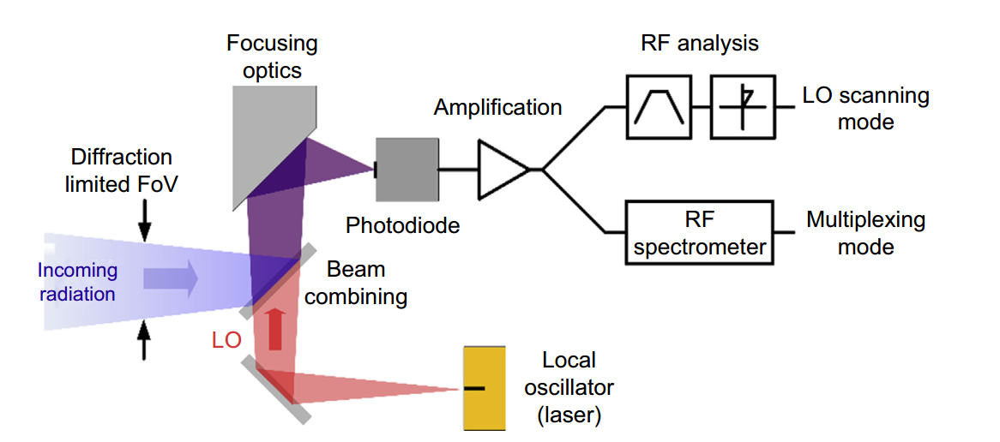
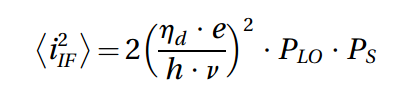

激光外差光谱法测量大气痕量气体

###### CH4.1.1 简介

`虽然本章介绍的原理和概念在波长方面是通用的，但对技术及其实现的描述则侧重于电磁波谱中红外部分的应用 。`

关注中红外的原因有两方面：

(a) 在分子传感方“利用两个大的大气透明窗口”的意思是，该技术选择在中红外波段进行研究，是因为这个波段内恰好有几个关键的“缝隙”（即透明窗口），可以让仪器有效地接收到目标分子的光谱信息，从而实现高灵敏度的测量 。面，中红外波段可以探测到强烈的分子振动-转动基频带，并能利用两个大的大气透明窗口（1） ；

`“大气透明窗口”（atmospheric transparency window）指的是电磁波谱中地球大气层吸收较弱、相对“透明”的特定波长（或波数）范围 。`

`低吸收区：大气中含有水蒸气、二氧化碳等多种气体，它们会在很多波段强烈吸收电磁波。但在某些特定的波段，这种吸收效应很弱，使得来自太阳或太空的辐射能够穿透大气层到达地面，或者地面/大气中发出的辐射能够穿透到太空。这些吸收弱的波段就是“透明窗口”。`

`观测的通道：这些窗口对于遥感至关重要。因为可以利用这些“窗口”作为清晰的通道，来观测窗口内特定痕量气体（如臭氧、甲烷）的微弱吸收信号 。如果在一个吸收很强的波段进行观测，那么目标气体的信号就会被大气本身完全掩盖。`

`（1）：“利用两个大的大气透明窗口”的意思是，该技术选择在中红外波段进行研究，是因为这个波段内恰好有几个关键的“缝隙”（即透明窗口），可以让仪器有效地接收到目标分子的光谱信息，从而实现高灵敏度的测量 。`

(b) 激光和光子技术在这些波段已取得显著发展并持续进步，这预示着在远程高光谱分辨率分子传感方面，新系统和新能力的良好前景 。

###### CH4.1.2 发展简史

###### CH4.2.1 基本原理


(1) 只要LO是已知、稳定且用作参考的，光电流信号就允许直接测量信号的频率和相位 。相位被保留，信号频率被下转换到中频 。下转换的源频谱将是双边带的，其一半功率在 ωLO−ωS，另一半在 ωS−ωLO 。

(2) 在正常操作中，信号很弱，而LO功率比信号大几个数量级 。因此，当考虑光电流时，外差探测通过一个增益，提供了一种对信号功率的放大形式 。



`激光外差光谱辐射仪（LHR）的顶层架构如图4所示，其中只表示了关键元件：`

`LO；光束合束元件，其最简单形式可以是分束器；一些将合束光束聚焦到高速光电二极管表面的光学器件；`

`光电二极管本身，也称为光电混频器；`

`以及IF信号的放大级 。`

`放大后，IF信号可以在LO扫描模式或多路复用模式下处理 。对于前一种模式，使用一个固定带宽的滤波器，并且该带宽内的IF功率由一个平方律射频（RF）探测器（例如肖特基二极管）检测 。假设光电混频器的带宽大于带通滤波器的高频截止频率 。通过调谐LO，源频谱的不同频率分量被依次分析，从而解析出源频谱 。对于后一种模式，光电混频器带宽内的整个下转换频谱通过RF光谱分析进行处理，带来了频谱多路复用的好处 。请注意，入射辐射可以针对一个辐射负载进行幅度调制，以便使用锁相检测（PSD）来恢复与亮度对比度成正比的信号 。`

###### CH4.2.1.2噪声模型；4.2.1.3 信噪比和噪声等效功率

###### CH4.2.1.4 外差效率



上述公式的外差信号是为单色平面波的理想情况建立的，这些波完全空间相干，在光电混频器表面上完美共轴对准，其相位相前完美对齐，偏振态也匹配 。

在实际系统中，会发生其他降低外差混频效率的因素 。外差效率的概念不应与探测器的量子效率相混淆，因为它还考虑了**相位相前重叠效率、相位匹配效应、空间相干性和探测器响应均匀性**。

总的来说，外差检测系统为窄视场和高光谱分辨率的光谱辐射测量提供了优势 。Menzies在Hinkley（1976）的著作中描绘了与高分辨率傅里叶变换光谱仪的更具体比较，再次指出，在高光谱分辨率、小视场和聚焦于窄光谱窗口的组合方面，激光外差光谱辐射仪提供了一套独特的探测优势 。

###### CH4.2.2大气信息反演；（正向模型-反演-总结）

##### CH4.3量子级联激光外差光谱辐射仪

###### 4.3.1.1 基本原理

臭氧的分布，人类影响，如何测量。

###### 4.3.1.3 实验系统开发


`图中的缩写分别为：ATT，衰减器；BB，黑体源；BS，分束器；CL，准直透镜；FM，翻转架；ISO，光隔离器；M，反射镜；MOD，光调制器；OAEM，离轴椭球镜；OAPM，离轴抛物镜；PD，光电二极管；QCL，量子级联激光器。`

光学系统四个模块：LO模块、源模块、频率校准模块、外差混频模块 。

光学系统的构建旨在最小化对激光器的光反馈`（会给外差信号带来额外的噪声和偏差 。透射光学元件被减至最少，对应使用反射光学元件 ）`和寄生驻波 。

LO模块：激光器单模运行，所需光功率取决于1.LO光路传输效率2.光路混频器所需最佳功率。ATT：可调衰减器，控制功率。LO光束由一个离轴抛物面镜（OAPM1）成像，在第一个针孔的平面上形成一个光束腰 。

频率校准模块：利用不参与外差混频的LO光。从针孔1开始，OAPM2重新准直光线 。根据一个翻转镜的状态，激光被送到一个可以填充低压参考气体的10厘米长气室（提供绝对频率校准），或一个锗法布里-珀罗标准具（提供相对频率校准，自由光谱范围约为500 MHz（0.017 cm⁻¹），标准具几何长度约为7.5厘米）。OAPM3将任一光束重新成像到光电二极管（PD2）上 。

源模块：选择并处理待仪器分析的辐射 。在正常的太阳掩星操作中，由日光反射跟踪仪收集的太阳光经过滤波，只保留与仪器相关的粗略中红外光谱范围 。

```
幅度调制器有两个作用：
(1) 在源信号上以几千赫兹的频率进行幅度调制，以实现在远离1/f噪声频率的锁相检测（PSD）。重要的是在信号源上进行调制，而不是在LO信号上，以最小化LO噪声对检测的贡献 。(2) 当以反射模式操作时，它能够针对一个已知源进行差分测量，从而补偿检测系统中可能发生的许多和大的漂移 。
```

外差混频模块：BS1共轭了针孔1和2，将LO和源辐射叠加 。鉴于QCL发射大量光功率，BS1通常采样10%-20%的LO光束，使其与90%-80%的信号光束共线对准 。OAEM1将共轭的针孔1和2重新成像到光电混频器表面（PD1）。

### 4.3.2 地基温室气体测量

甲烷

###### 4.3.2.4 用于温室气体测量的可部署LHR

CO2激光外差光谱辐射仪在实验室的精度非常理想，但是对于野外部署首先意味着降低尺寸和复杂性。同时也要考虑别的因素，如避免使用液氮消耗品以及易于远程操作的控制和采集接口。


选择CH4通道时，进行了窄光谱窗口评估，重点放在热红外波段，并考虑了覆盖1150−1400$cm^{-1}$（约7.1-8.7 μm）的CH4基频带。`它位于一个大气窗口的边缘，主要的不透明度由H2O决定，并有来自一氧化二氮（N2O）的强大潜在串扰。`覆盖约$1232-1234 cm^{-1}$的光谱区域被发现能提供关于$CH_4$大气含量的最高信息，同时来自其他吸收剂的串扰最小。CH4谱线被很好地隔离。虽然和邻近的H2O谱线部分重叠，但仪器的光谱分辨率允许这种水平的谱线选择性。

考虑激光外差光谱辐射仪开发的三个方面：**最佳LO功率、ILS测量和仪器稳定性。**

ILS:在LO扫描模式下，ILS主要由用于选择IF光谱功率中**对信号有贡献部分的带通滤波器定义**。


光混合器输出后的信号处理链示意图如上，LO和幅度调制的信号送到光电混频器，滤除直流，放大IF信号，由带通滤波器来决定仪器的光谱分辨率。总IF功率由平方律检波器来决定。

```
对于ILS的直接测量法：
用一个理想的单色光源（即光谱上无限窄的一条谱线）作为输入信号，然后看仪器如何“看到”这条谱线。仪器输出的信号形状，就是它自身的仪器线型函数（ILS）。
对于单侧光源：使用另一台QCL激光器。这台额外的QCL被用作“信号源”，它的工作波长范围与仪器内部的本地振荡器（LO）激光器相同。这台源QCL被设置为以一个固定的频率发射光，其线宽极窄，可以近似看作是单色的。
当LO的频率从低到高（或从高到低）扫过固定的源QCL频率时，两者之间会产生一个中频（IF）外差信号。
```

###### 4.3.2.5 大气发射（主动）

之前所描述的LHR`激光外差光谱辐射仪`工作模式都限制在白天，得到的是大气的投射光谱。

LHR 本身是热红外波段中灵敏度高、分辨率高的光谱仪，并已被用于解析遥远大气中的分子发射谱线 。`如果能测量地球大气成分的光谱分辨发射光谱，将能增强仪器的通用性，并摆脱对太阳背景源的依赖，从而实现从地面进行天顶（垂直向上）发射测量，或从机载、天基平台进行临边发射测量 。`

**在太阳掩星模式下**：目标是太阳，它是一个极其明亮的辐射源。参考源是室温下的机械斩波器叶片。与太阳相比，室温叶片自身的辐射“微不足道”，可以近似看作一个“零辐射”的黑暗背景。因此，信号对比度非常高，很容易测量。

**在发射光谱模式下**：目标是天空自身，大气分子的热发射信号非常微弱。在这种情况下，如果仍然使用室温的斩波器叶片作为参考，问题就来了：**参考源（叶片）自身的辐射强度与目标（天空）的辐射强度几乎在同一水平**。仪器需要在这两个非常接近的微弱信号之间寻找一个更微弱的差异，这会导致信号对比度极低，有效信号几乎被噪声淹没。`为了解决这个问题，必须使用一个辐射远低于待测信号的参考源。原文中提到，他们为此专门开发了一个可以冷却到70K（约-203℃）的黑体腔。当仪器在“天空”和这个“70K的超冷黑体”之间切换时，就产生了一个巨大且清晰的信号差异（高对比度），使得微弱的大气发射信号能够被精确地测量出来。`

###### CH4.3.3用于多物种测量

| 激光器                                           | 波数（cm^-1^） | 频率（Hz）     |
| ------------------------------------------------ | -------------- | -------------- |
| 标准的**分布式反馈（DFB）QCL激光器**             | 10             | 300G           |
| 新型**外腔QCL（EC-QCL）**                        | 120            | 3.6 T          |
| EC-QCL进行**精细、连续频率扫描**时的工作窗口宽度 | 1              | 30 G           |
| EC-QCL本地振荡器（LO）**具体的总光谱覆盖区域**   | 1120-1238      | 33.6 T-37.1 Hz |

##### CH4.4 面向天基测量的展望

小型平台部署LHR的展望性概念

4.4.1 小型卫星任务概念

4.4.1.1温室气体垂直廓线测量


航天器上的仪器在每个轨道上执行两次测量序列`分别在日出和日落时`。当航天器移出（或进入）地球阴影时，通过对准太阳盘进行快速的测量序列，可以在一系列切线高度上实现对大气的高空间分辨率廓线测量。`虽然使用太阳作为背景源限制了时间分辨率（每个轨道只有两个廓线），但太阳背景的强亮度为大气透射率的测量带来了显著的信噪比提升和宽松的定标要求。`通过微卫星星座实现太阳掩星高光谱分辨率临边透射光谱测量，可以克服时间覆盖的限制。这种探测配置非常适合以高垂直分辨率表征==中高层大气==，因为在自由对流层以上，大气的变率减小‘。


<!--左边为MISO LHR；右边为集成LHR在航天器在的状态
该有效载荷的总体积为1.5立方分米，尺寸为10cmx30cmx5cm-->

按照辐射进入仪器的顺序：首先穿过一个散热滤光片`一个二向色带通滤光片，只让目标的中红外辐射通过，并反射其余的太阳光谱以避免热量积聚。`之后，望远镜的主镜（直径25毫米），副镜，太阳盘成像，构成集成LHR的HW模块的输入端口。

在集成LHR的背面是高速光电混频器的偏置电子电路和前置放大器。

在有效载荷的更后方，堆叠了两块电子板：下面一块专门用于LO的电流和温度控制，上面一块则包含了其余的采集、处理和辅助仪器系统控制。

4.4.1.2 在气象学应用中的展望

对于温湿度探测，高信息含量的光谱通道位于热红外区域：中心在$667 cm^{-1}$的$CO_2$的v2带用于温度探测，中心在$1595 cm^{-1}$的$H_2O$的v2带用于水汽探测。

Q:一个以非常高的光谱分辨率（0.001−0.01$cm^{-1}$）测量窄光谱窗口（< 1.0$cm^{-1}$）的激光外差光谱辐射仪，能否为NWP应用提供有用的大气温度附加信息？

```
"小型化LHR最有希望的前景要求在复用模式下运行"
1.LO扫描模式：仪器只使用一个固定带宽的RF滤波器，因此一次只能测量一个光谱点。为了获得一个完整的光谱，需要通过缓慢改变本地振荡器（LO）激光器的频率（即“扫描”）来逐点测量 。
2.复用模式：不再使用单个滤波器，而是使用一个RF频谱仪（RF spectrometer）来处理信号。仪器可以在保持LO激光器频率固定的情况下，对光电混频器带宽内的整个下转换频谱进行一次性、并行的分析和记录。


```

###### 4.5 结论、更广阔的背景及未来展望


